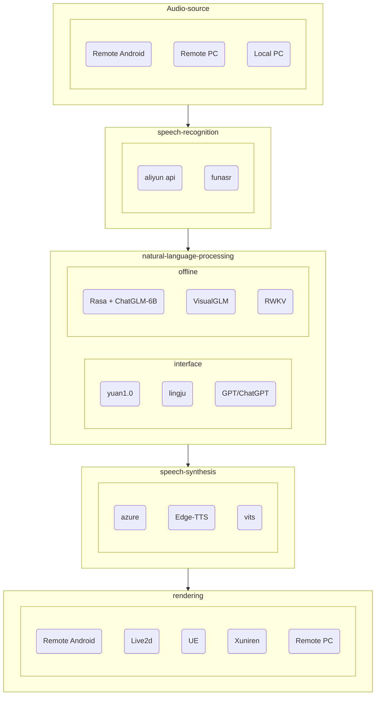

<div align="center">
    <br>
    
    <h1>FAY</h1>
	<h3>Fay Digital Human Assistant</h3>
</div>


Fay Digital Human Assistant Edition is an important branch of the Fay open-source project, focusing on building open-source solutions for intelligent digital assistants. It offers a flexible and modular design that allows developers to customize and combine various functional modules, including emotion analysis, NLP processing, speech synthesis, and speech output, among others. Fay Digital Assistant Edition provides developers with powerful tools and resources for building intelligent, personalized, and multifunctional digital assistant applications. With this edition, developers can easily create digital assistants applicable to various scenarios and domains, providing users with intelligent voice interactions and personalized services.


## **Fay Digital Assistant Edition **

ProTip:The shopping edition has been moved to a separate branch.[`fay-sales-edition`](https://github.com/TheRamU/Fay/tree/fay-sales-edition)


Fay Controller Usage in Assistant Edition: Voice communication, voice and text responses; text communication, text responses.


## **Fay Controller Core Logic**




### **Code Structure**

```
.

├── main.py					# Program main entry
├── fay_booter.py			# Core boot module
├── config.json				# Controller configuration file
├── system.conf				# System configuration file
├── ai_module
│   ├── ali_nls.py			# Aliyun Real-time Voice
│   ├── ms_tts_sdk.py       # Microsoft Text-to-Speech
│   ├── nlp_lingju.py       # Lingju Human-Machine Interaction - Natural Language Processing
│   ├── xf_aiui.py          # Xunfei Human-Machine Interaction - Natural Language Processing
│   ├── nlp_gpt.py          # GPT API integration
│   ├── nlp_chatgpt.py      # Reverse integration with chat.openai.com
│   ├── nlp_yuan.py         # Langchao. Yuan model integration
│   ├── nlp_rasa.py         # Preceding Rasa conversation management based on ChatGLM-6B (highly recommended)
│   ├── nlp_VisualGLM.py    # Integration with multimodal large language model VisualGLM-6B
│   ├── nlp_rwkv.py         # Offline integration with rwkv
│   ├── nlp_rwkv_api.py     # rwkv server API
│   ├── yolov8.py           # YOLOv8 object detection
│   └── xf_ltp.py           # Xunfei Sentiment Analysis
├── bin                     # Executable file directory
├── core                    # Digital Human Core
│   ├── fay_core.py         # Digital Human Core module
│   ├── recorder.py         # Recorder
│   ├── tts_voice.py        # Speech synthesis enumeration
│   ├── authorize_tb.py     # fay.db authentication table management
│   ├── content_db.py       # fay.db content table management
│   ├── interact.py         # Interaction (message) object
│   ├── song_player.py      # Music player (currently unavailable)
│   └── wsa_server.py       # WebSocket server
├── gui                     # Graphical interface
│   ├── flask_server.py     # Flask server
│   ├── static
│   ├── templates
│   └── window.py           # Window module
├── scheduler
│   └── thread_manager.py   # Scheduler manager
├── utils                   # Utility modules
│   ├── config_util.py
│   ├── storer.py
│   └── util.py
└── test                    # All surprises

```


## **Upgrade Log**
**2023.07.14：**

+ Fixed Linux and macOS runtime errors.
+ Fixed the issue of being unable to continue execution due to lip-sync errors.
+ Provided an integration solution for RWKV.

**2023.07.12：**

+ Fixed an issue in Assistant Edition where text input does not read persona responses.
+ Fixed an issue in Assistant Edition where text input does not read QA responses.
+ Enhanced microphone stability.

**2023.07.05：**

+ Fixed a sound playback issue caused by the inability to run the lip-sync algorithm.

**2023.06：**

+ Refactored NLP module management logic for easier extension.
+ Split GPT into ChatGPT and GPT, replaced with a new GPT interface, and added the ability to configure proxy servers separately.
+ Specified the version of the YOLOv8 package to resolve YOLO compatibility issues.
+ Fixed self-talk bug and receiving multiple messages to be processed bug.
+ Integrated Lingju NLP API (supporting GPT3.5 and multiple applications).
+ UI corrections.
+ Integrated local lip-sync algorithm.
+ Resolved compatibility issues with multi-channel microphones.
+ Refactored fay_core.py and fay_booter.py code.
+ UI layout adjustments.
+ Restored sound selection.
+ Fixed logic for displaying "Thinking..."


## **Installation Instructions**


### **Environment** 
- Python 3.9、3.10
- Windows、macos、linux

### **Installing Dependencies**

```shell
pip install -r requirements.txt
```

### **Configuring Application Key**
+ View [AI Modules](#ai-modules)
+  Browse the link, register, and create an application. Fill in the application key in `./system.conf` 

### **Starting**

Starting Fay Controller

```shell
python main.py
```


### **AI Modules**

Application Key needs to be filled in before starting

| File                        | Description                                              | Link                                                         |
|-----------------------------|----------------------------------------------------------|--------------------------------------------------------------|
| ./ai_module/ali_nls.py      | Real-time Speech Recognition (optional, free for 3 months) | https://ai.aliyun.com/nls/trans                              |
| ./ai_module/funasr.py       | Open-source Free Local ASR by Alibaba DAMO Academy (optional) | fay/test/funasr/README.MD                           |
| ./ai_module/ms_tts_sdk.py   | Microsoft Text-to-Speech with Emotion (optional, defaults to free edge-tts) | https://azure.microsoft.com/zh-cn/services/cognitive-services/text-to-speech/ |
| ./ai_module/xf_ltp.py       | Xunfei Sentiment Analysis                                 | https://www.xfyun.cn/service/emotion-analysis                |
| ./utils/ngrok_util.py       | ngrok.cc External Network Penetration (optional)          | http://ngrok.cc                                              |
| ./ai_module/nlp_lingju.py   | Lingju NLP API (supports GPT3.5 and multiple applications) | https://open.lingju.ai   Contact customer service to enable GPT3.5 access |
| ./ai_module/yuan_1_0.py     | Langchao Yuan Model (NLP, choose one)                     | https://air.inspur.com/                                              |
| ./ai_module/chatgpt.py      | ChatGPT (NLP, choose one)                                 | *******                                              |
| ./ai_module/nlp_rasa.py     | Preceding Rasa Conversation Management based on ChatGLM-6B (NLP, choose one) | https://m.bilibili.com/video/BV1D14y1f7pr |
| ./ai_module/nlp_VisualGLM.py | Integration with VisualGLM-6B Multimodal Offline Large Language Model (NLP, choose one) | Bilibili video |


## **Instructions for Use**


### **Instructions for Use**

+ Voice Assistant: Fay Controller (with microphone input source enabled and panel playback enabled).
+ Remote Voice Assistant: Fay Controller (with panel playback disabled) + Remote device integration.
+ Digital Human Interaction: Fay Controller (with microphone input source enabled, panel playback disabled, and personality Q&A filled) + Digital Human.
+ Jarvis, Her: Join us to complete the experience together.


### **Voice Commands**

| Shut down                  | Mute                       | Unmute                                                         |
| ------------------------- | -------------------------- | ------------------------------------------------------------ |
| Shut down, Goodbye, Go away    | Mute, Be quiet, I want silence        |   Unmute, Where are you, You can speak now                           |


### **For business inquiries**

**Contact QQ **: 467665317

We provide development consulting, custom digital human models, and implementation services for educational resources in universities.

http://yafrm.com/forum.php?mod=viewthread&tid=302

Follow our WeChat official account(fay数字人)Get the latest QR code for the WeChat technical discussion group (**Please star this repository first**)


