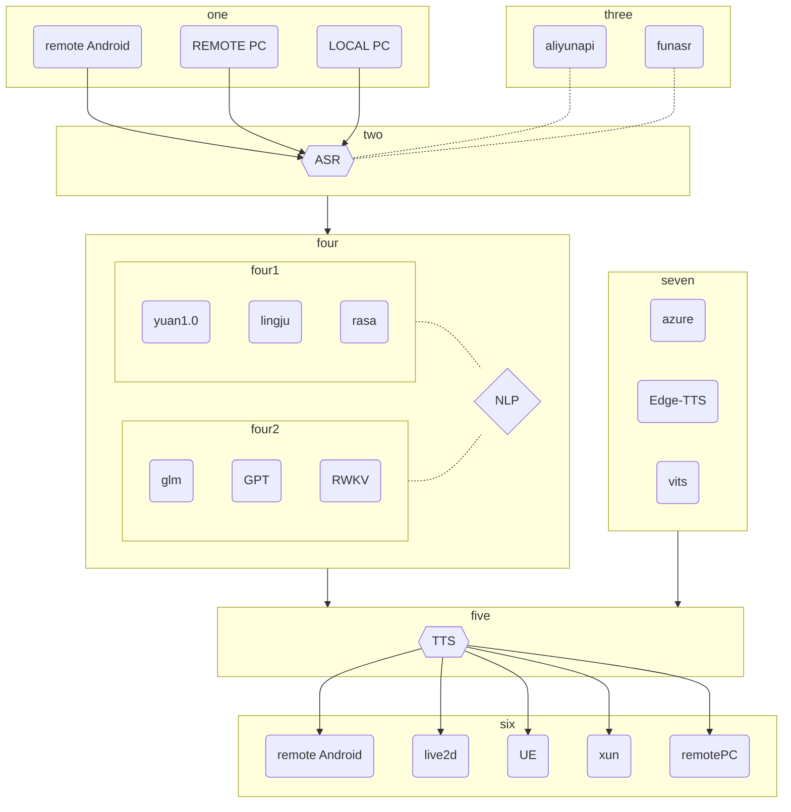

```mermaid

flowchart TB

    aa-->asr
    cc-->asr
    bb-->asr

    aliyun-.-asr
    funasr-.-asr

    tts-->sixa
    tts-->sixb
    tts-->sixc
    tts-->sixd
    tts-->sixe

 

    subgraph one
    aa("remote Android")
    cc("REMOTE PC")
    bb("LOCAL PC")
    end

    subgraph two
    asr{{"ASR"}}
    end

    subgraph three
    aliyun("aliyunapi")
    funasr("funasr")  
    end

    subgraph four
    nlp{"NLP"}
     subgraph four1

     eighta("yuan1.0")
     eightb("lingju")
     eightc("rasa")
    
     end
      subgraph four2
      eightd("glm")
      eighte("GPT")
      eightf("RWKV")
      end
    end

    subgraph five
    tts{{"TTS"}}
    end

    subgraph six
    sixa("remote Android")
    sixb("live2d")
    sixc("UE")
    sixd("xun")
    sixe("remotePC")
    end

    subgraph seven
    seven_az("azure")
    seven_edg("Edge-TTS")
    seven_vi("vits")
    end

    two --> four
    four --> five
    seven --> five
    four1-.- nlp
    four2-.- nlp

```
