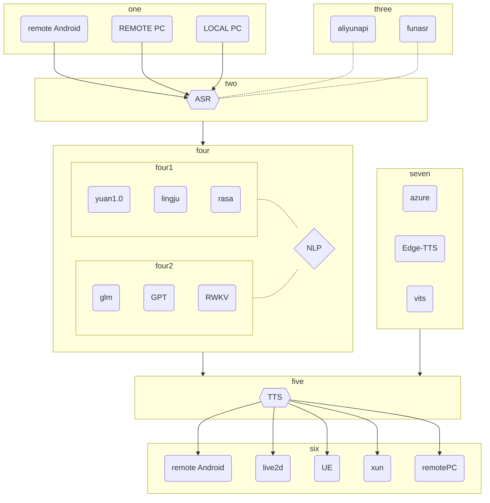

<div align="center">
    <br>
    
    <h1>FAY</h1>
	<h3>Fay数字人助理</h3>
</div>


Fay数字人助理版是fay开源项目的重要分支，专注于构建智能数字助理的开源解决方案。它提供了灵活的模块化设计，使开发人员能够定制和组合各种功能模块，包括情绪分析、NLP处理、语音合成和语音输出等。Fay数字人助理版为开发人员提供了强大的工具和资源，用于构建智能、个性化和多功能的数字助理应用。通过该版本，开发人员可以轻松创建适用于各种场景和领域的数字人助理，为用户提供智能化的语音交互和个性化服务。

## **逻辑**




## **四、安装说明**


### **环境** 
- Python 3.9、3.10
- Windows、macos、linux

### **安装依赖**

```shell
pip install -r requirements.txt
```

### **配置应用密钥**
+ 查看 [AI 模块](#ai-模块)
+ 浏览链接，注册并创建应用，将应用密钥填入 `./system.conf` 中

### **启动**
启动Fay控制器
```shell
python main.py
```


### **AI 模块**
启动前需填入应用密钥

| 代码模块                  | 描述                       | 链接                                                         |
| ------------------------- | -------------------------- | ------------------------------------------------------------ |
| ./ai_module/ali_nls.py    | 实时语音识别（非必须，免费3个月,asr二选一）    | https://ai.aliyun.com/nls/trans                              |
| ./ai_module/funasr.py    | 达摩院开源免费本地asr （非必须，asr二选一）   | fay/test/funasr/README.MD                           |
| ./ai_module/ms_tts_sdk.py | 微软 文本转情绪语音（非必须，不配置时使用免费的edge-tts） | https://azure.microsoft.com/zh-cn/services/cognitive-services/text-to-speech/ |
| ./ai_module/xf_ltp.py     | 讯飞 情感分析              | https://www.xfyun.cn/service/emotion-analysis                |
| ./utils/ngrok_util.py     | ngrok.cc 外网穿透（可选）  | http://ngrok.cc                                              |
| ./ai_module/nlp_lingju.py | 灵聚NLP api(支持GPT3.5及多应用)（NLP多选1） | https://open.lingju.ai   需联系客服务开通gpt3.5权限|
| ./ai_module/yuan_1_0.py    | 浪潮源大模型（NLP 多选1） | https://air.inspur.com/                                              |
| ./ai_module/chatgpt.py     | ChatGPT（NLP多选1） | *******                                              |
| ./ai_module/nlp_rasa.py    | ChatGLM-6B的基础上前置Rasa会话管理（NLP 多选1）  | https://m.bilibili.com/video/BV1D14y1f7pr |
| ./ai_module/nlp_VisualGLM.py | 对接VisualGLM-6B多模态单机离线大语言模型（NLP 多选1） | B站视频 |


## **五、使用说明**


### **使用说明**

+ 语音助理：fay控制器（麦克风输入源开启、面板播放开启）；
+ 远程语音助理：fay控制器（面板播放关闭）+ 远程设备接入；
+ 数字人互动：fay控制器（麦克风输入源开启、面板播放关闭、填写性格Q&A）+ 数字人；
+ 贾维斯、Her：加入我们一起完成。


### **语音指令**

| 关闭核心                  | 静音                       | 取消静音                                                         |
| ------------------------- | -------------------------- | ------------------------------------------------------------ |
| 关闭、再见、你走吧   | 静音、闭嘴、我想静静        |   取消静音、你在哪呢、你可以说话了                            |

| 播放歌曲(音乐库暂不可用)                  | 暂停播放                       | 更多                                                         |
| ------------------------- | -------------------------- | ------------------------------------------------------------ |
| 播放歌曲、播放音乐、唱首歌、放首歌、听音乐、你会唱歌吗   | 暂停播放、别唱了、我不想听了        |     没有了...                          |

### **人设**
数字人属性，与用户交互中能做出相应的响应。
#### 交互灵敏度
在交互中，数字人能感受用户的情感，并作出反应。最直的体现，就是语气的变化，如 开心/伤心/生气 等。
设置灵敏度，可改变用户情感对于数字人的影响程度。

### **接收来源**

#### 文本输入

通过沟通窗口与助理文本沟通

#### 麦克风

选择麦克风设备，实现面对面交互，成为你的伙伴

#### socket远程音频输入

可以接入远程音频输入，远程音频输出


商务联系QQ 467665317，我们提供：开发顾问、数字人模型定制及高校教学资源实施服务
http://yafrm.com/forum.php?mod=viewthread&tid=302

关注公众号(fay数字人)获取最新微信技术交流群二维码（**请先star本仓库**）

https://github.com/TheRamU/Fay/blob/main/images/gzh.jpg)
