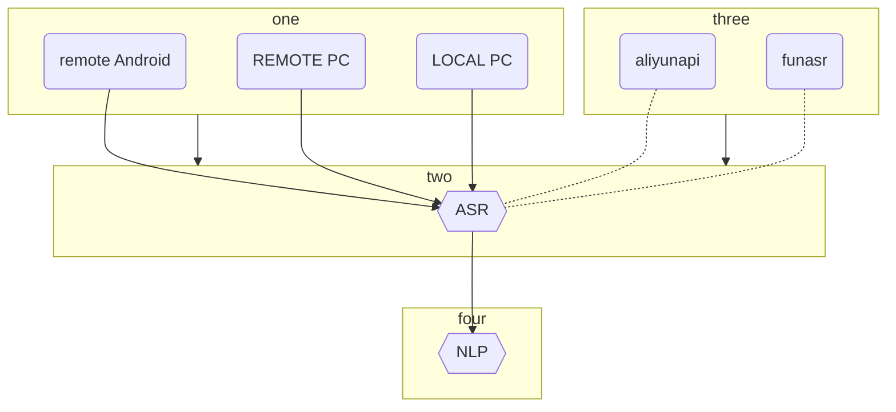
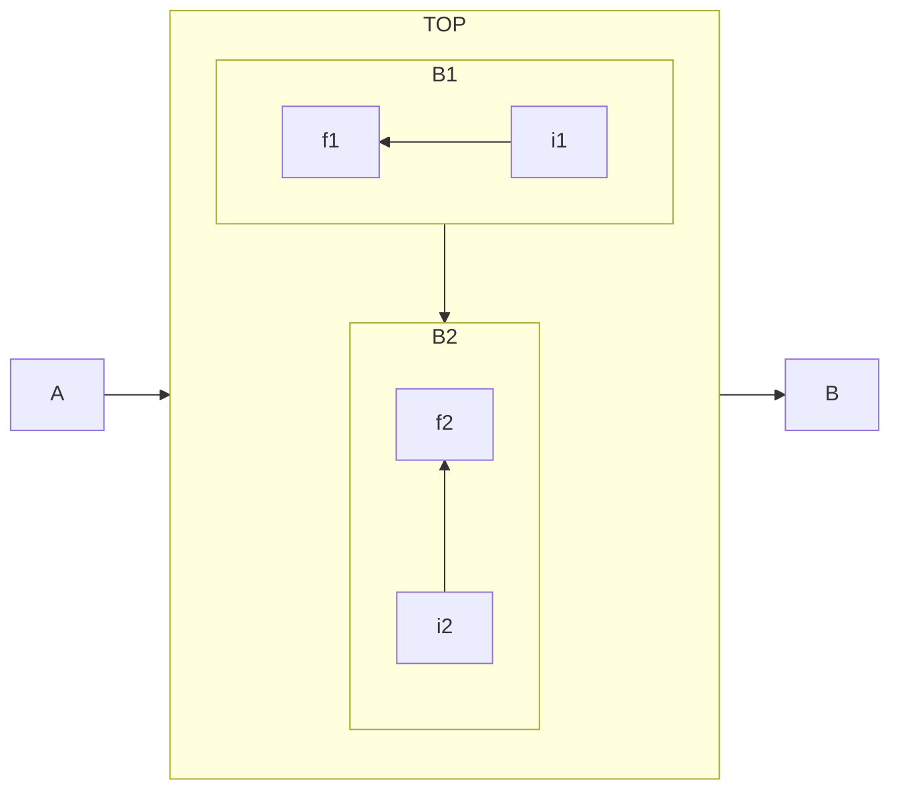
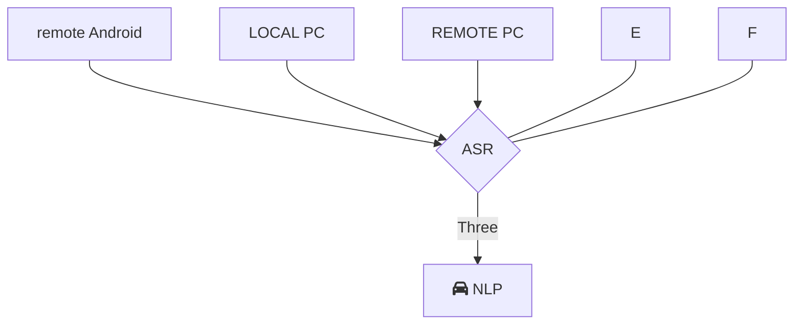

```mermaid
flowchart TB

    aa-->asr
    cc-->asr
    bb-->asr

    aliyun-.-asr
    funasr-.-asr

    asr-->nlp

    subgraph one
    aa("remote Android")
    cc("REMOTE PC")
    bb("LOCAL PC")
    end

    subgraph two
    asr{{"ASR"}}
    end

    subgraph three
    aliyun("aliyunapi")
    funasr("funasr")  
    end

    subgraph four
    nlp{{"NLP"}}
    end


    one --> two
    three --> two


```

```mermaid
flowchart LR
  subgraph TOP
    direction TB
    subgraph B1
        direction RL
        i1 -->f1
    end
    subgraph B2
        direction BT
        i2 -->f2
    end
  end
  A --> TOP --> B
  B1 --> B2
```

```mermaid
flowchart TD
    A[remote Android] -->  D{ASR}
    B[LOCAL PC] -->   D{ASR}
    C[REMOTE PC] -->   D{ASR}
    E--- D{ASR}
    F--- D{ASR}
    D -->|Three| G[fa:fa-car NLP]

```
