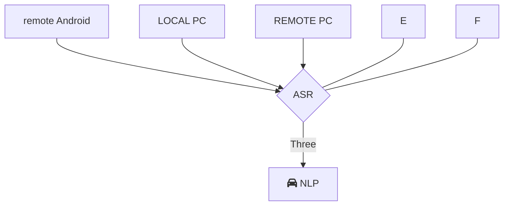
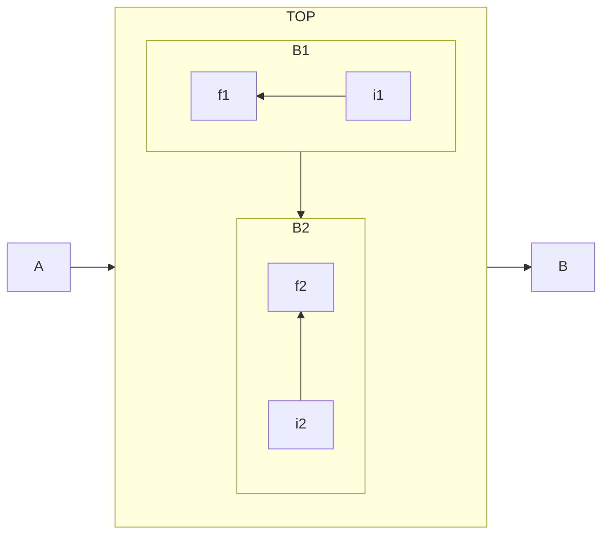
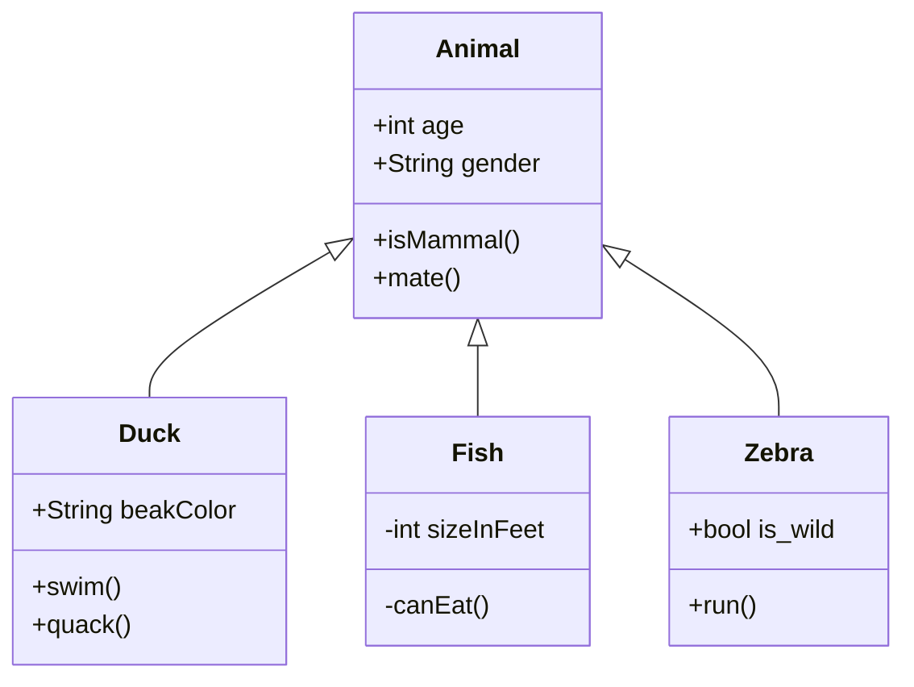

# Fay

```mermaid
flowchart TD
    A[remote Android] -->  D{ASR}
    B[LOCAL PC] -->   D{ASR}
    C[REMOTE PC] -->   D{ASR}
    E--- D{ASR}
    F--- D{ASR}
    D -->|Three| G[fa:fa-car NLP]


```

```mermaid
flowchart LR
  subgraph TOP
    direction TB
    subgraph B1
        direction RL
        i1 -->f1
    end
    subgraph B2
        direction BT
        i2 -->f2
    end
  end
  A --> TOP --> B
  B1 --> B2
```

# testmd

```mermaid

classDiagram
    Animal <|-- Duck
    Animal <|-- Fish
    Animal <|-- Zebra
    Animal : +int age
    Animal : +String gender
    Animal: +isMammal()
    Animal: +mate()
    class Duck{
        +String beakColor
        +swim()
        +quack()
    }
    class Fish{
        -int sizeInFeet
        -canEat()
    }
    class Zebra{
        +bool is_wild
        +run()
    }
```

