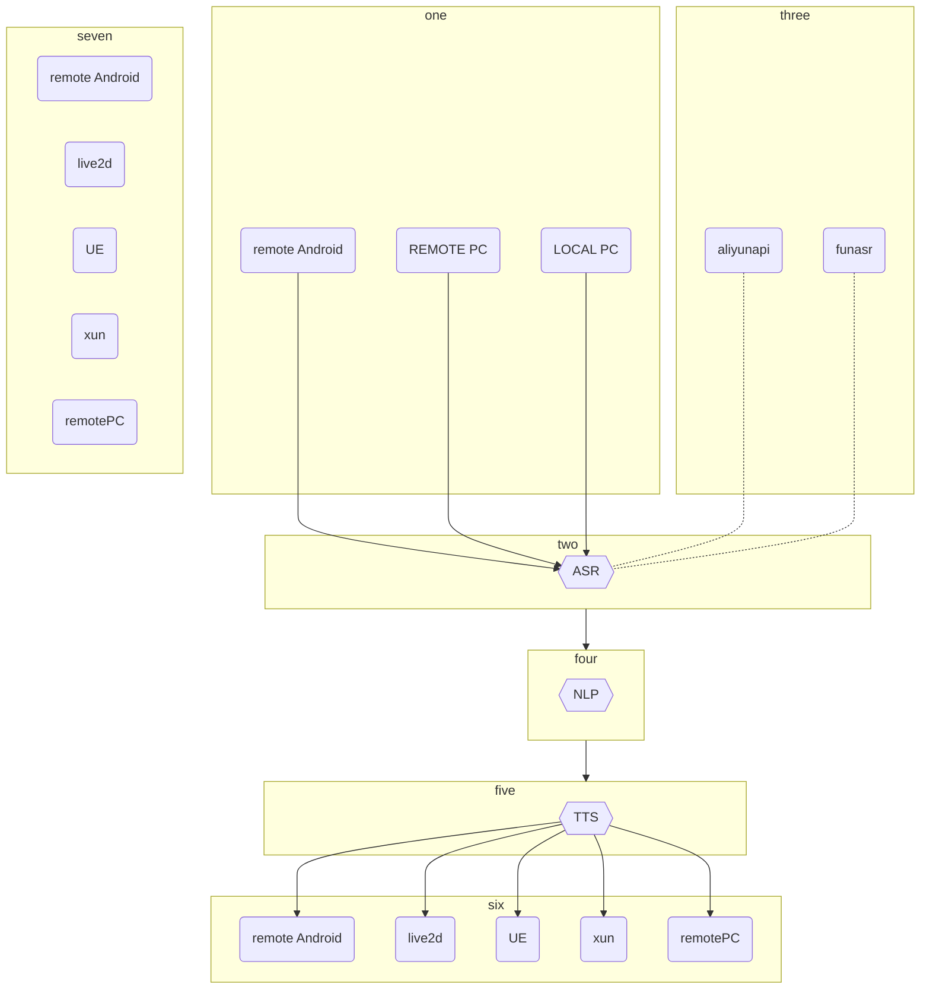

```mermaid
flowchart TB

    aa-->asr
    cc-->asr
    bb-->asr

    aliyun-.-asr
    funasr-.-asr

    tts-->sixa
    tts-->sixb
    tts-->sixc
    tts-->sixd
    tts-->sixe

    subgraph one
    aa("remote Android")
    cc("REMOTE PC")
    bb("LOCAL PC")
    end

    subgraph two
    asr{{"ASR"}}
    end

    subgraph three
    aliyun("aliyunapi")
    funasr("funasr")  
    end

    subgraph four
    nlp{{"NLP"}}
    end

    subgraph five
    tts{{"TTS"}}
    end


    subgraph six
    sixa("remote Android")
    sixb("live2d")
    sixc("UE")
    sixd("xun")
    sixe("remotePC")
    end


    subgraph seven
    1sixa("remote Android")
    1sixb("live2d")
    1sixc("UE")
    1sixd("xun")
    1sixe("remotePC")
    end

    two --> four
    four --> five


```
