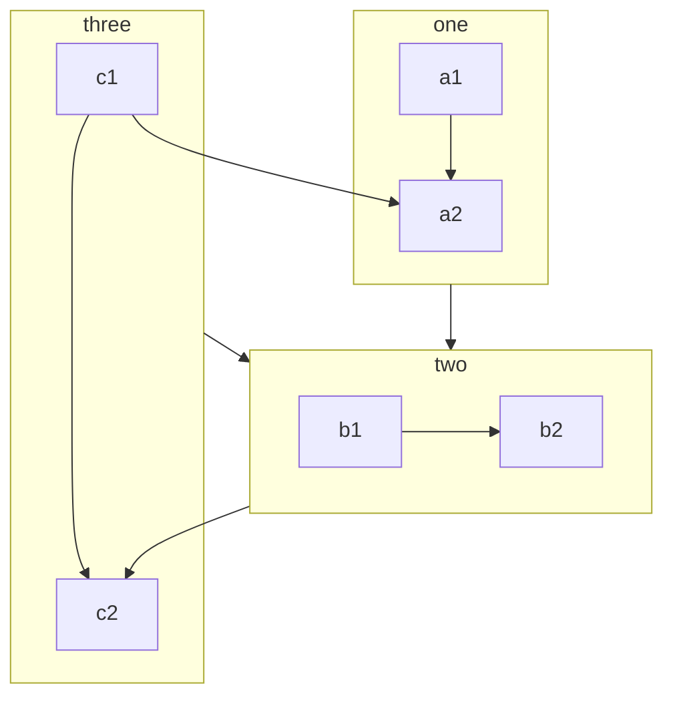
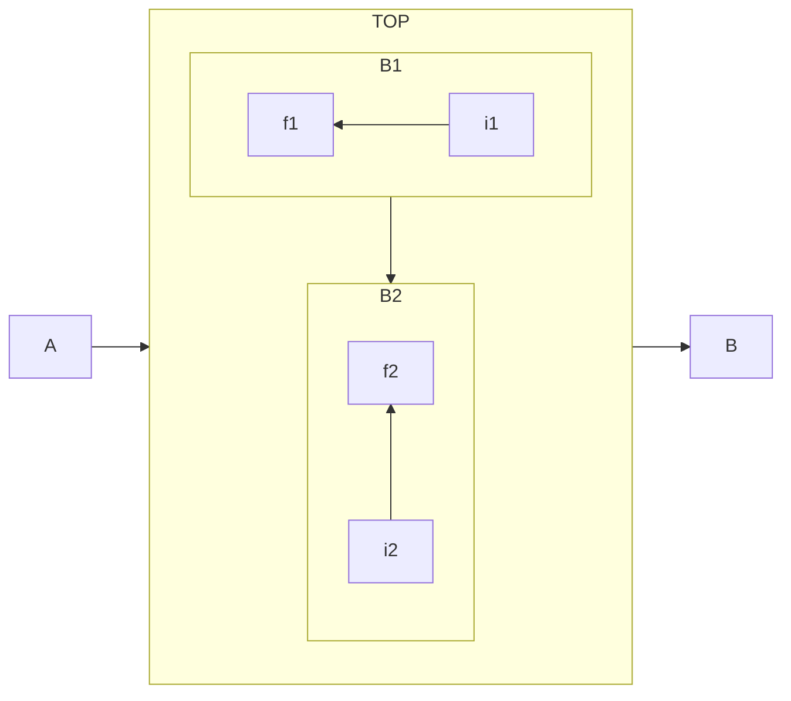
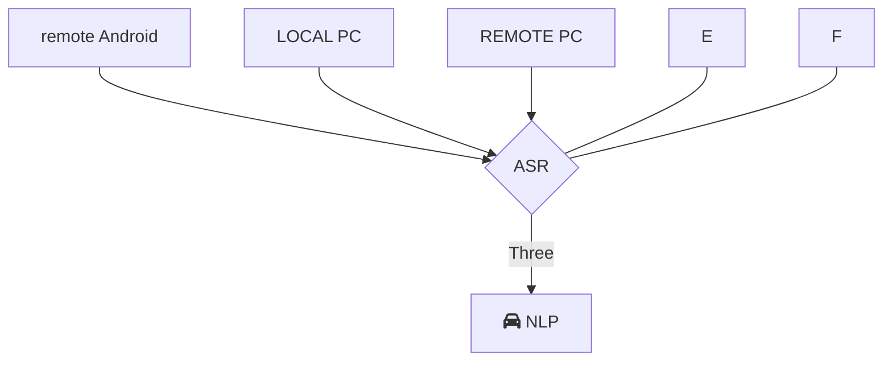

```mermaid
flowchart TB
    c1-->a2
    subgraph one
    a1-->a2
    end
    subgraph two
    b1-->b2
    end
    subgraph three
    c1-->c2
    end
    one --> two
    three --> two
    two --> c2

```

```mermaid
flowchart LR
  subgraph TOP
    direction TB
    subgraph B1
        direction RL
        i1 -->f1
    end
    subgraph B2
        direction BT
        i2 -->f2
    end
  end
  A --> TOP --> B
  B1 --> B2
```

```mermaid
flowchart TD
    A[remote Android] -->  D{ASR}
    B[LOCAL PC] -->   D{ASR}
    C[REMOTE PC] -->   D{ASR}
    E--- D{ASR}
    F--- D{ASR}
    D -->|Three| G[fa:fa-car NLP]

```
