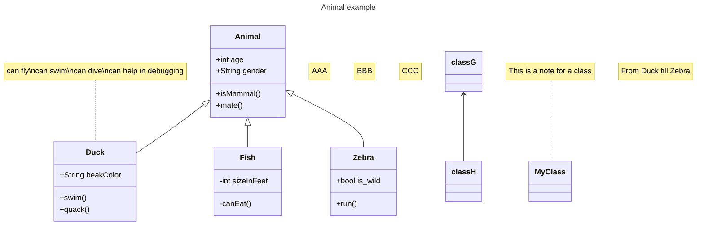

## FAY

```mermaid

---
title: Animal example
---
classDiagram
    note  "AAA" 
    note  "BBB"
    note  "CCC"
    note for MyClass "This is a note for a class"
    class MyClass{
    }


    Animal <|-- Duck
    note for Duck "can fly\ncan swim\ncan dive\ncan help in debugging"
    Animal <|-- Fish
    note "From Duck till Zebra"
    Animal <|-- Zebra

    Animal : +int age
    Animal : +String gender
    Animal: +isMammal()
    Animal: +mate()

    class Duck{
        +String beakColor
        +swim()
        +quack()
    }
    class Fish{
        -int sizeInFeet
        -canEat()
    }
    class Zebra{
        +bool is_wild
        +run()
    }


    classG <-- classH 

```
